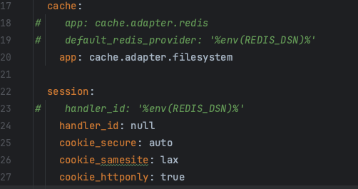

# 💱 Currency Converter Service

A demo-yet-production‑ready service that converts amounts between currencies using **swop.cx** (EUR as base).  
It ships with Redis caching, CSRF protection, strict CSP, metrics (InfluxDB + Grafana), a Vue 3 UI, and full Docker Compose.

> **Rates model:** swop.cx exposes **EUR → {currency}**. We support **any → any** via `from → EUR → to`.

---

## 🧩 Architecture

```
docker-compose
├─ nginx       → serves Symfony API at /api; can serve built SPA at /app
├─ php         → PHP-FPM + Symfony backend
├─ node        → Vite dev server for the UI (port 5173)
├─ redis       → cache for exchange rates
├─ influxdb    → metrics store
├─ grafana     → dashboards
```

### Components
- **Symfony 7 / PHP 8.3** – API, validation, CSRF, caching, metrics
- **Vue 3 + Vite** – SPA UI
- **Redis** – response/cache layer (TTL configurable)
- **InfluxDB + Grafana** – request metrics & visualization
- **Nginx** – reverse proxy with CSP + security headers

---

## ✅ Feature Highlights

- Strongly-typed Symfony services & validators
- CSRF‑protected POST endpoints (`X-CSRF-TOKEN`)
- Same‑origin API calls via Vite proxy (no CORS)
- Redis cache (configurable TTL)
- Dockerized dev environment
- Clean UI styles and i18n‑ready formatting

> **Note on session timeout:** There is **no automatic timeout** enabled by default. Sessions last until logout or PHP/session defaults. You can add an inactivity timeout later if desired.

---

## ⚙️ Quick Start (Development)

> In dev, you run the UI on **http://localhost:5173** (Vite) and the API behind Nginx on **http://localhost:8080**.  
> Vite **proxies** `/api/*` to Nginx, so your browser talks only to `:5173`.

1) Clone & configure:
```bash
git clone <repo-url>
cd currency-converter-service
cp .env.example .env
```

2) Bring everything up:
```bash
docker compose up -d --build
```

3) (If backend deps are not yet installed)
```bash
docker compose exec php composer install
```
4) Bring back commented lines and remove extra ones in **framework.yaml** (if we want to deploy it for ex. on https://fly.io/, Redis is payed instance, in this case we use for free developing locally)



5) If running the app locally please use the following nginx.conf

```
worker_processes  auto;

events { worker_connections 1024; }

http {
  include       /etc/nginx/mime.types;
  default_type  application/octet-stream;

  sendfile on;
  tcp_nopush on;
  keepalive_timeout 65;

  # --- Compression ---
  gzip on;
  gzip_types text/plain text/css application/javascript application/json application/xml image/svg+xml;
  gzip_min_length 1024;
  gzip_vary on;

  server {
    listen 80;
    server_name _;

    # Symfony public dir
    root /var/www/html/public;
    index index.php index.html;

    # --- Content Security Policy (SINGLE LINE — no newlines) ---
    add_header Content-Security-Policy "default-src 'self'; script-src 'self' http://localhost:5173 'unsafe-inline' 'unsafe-eval'; script-src-elem 'self' http://localhost:5173 'unsafe-inline'; style-src 'self' 'unsafe-inline'; style-src-elem 'self' 'unsafe-inline'; img-src 'self' data:; font-src 'self' data:; connect-src 'self' http://localhost:5173 ws://localhost:5173; object-src 'none'; base-uri 'self'; frame-ancestors 'none';" always;

    # --- Misc security headers ---
    add_header X-Content-Type-Options nosniff always;
    add_header X-Frame-Options DENY always;
    add_header Referrer-Policy no-referrer-when-downgrade always;

    # --- Size / timeouts ---
    client_max_body_size 4m;

    # --- Deny sensitive paths ---
    location ~* (^|/)\.(env|git|hg|svn) { deny all; }
    location = /composer.json            { deny all; }
    location = /composer.lock            { deny all; }

    # --- Long cache for built assets ---
    location ~* \.(?:js|css|mjs|map|png|jpg|jpeg|gif|svg|ico|webp|woff2?)$ {
      access_log off;
      expires 1y;
      add_header Cache-Control "public, max-age=31536000, immutable";
      try_files $uri =404;
    }

    # SPA build path (if you open http://localhost:8080/app/)
    location ^~ /app/ {
      try_files $uri $uri/ /app/index.html;
    }

    # API to PHP front controller
    location ^~ /api/ {
      try_files $uri /index.php$is_args$args;
    }

    # Redirect root to SPA (optional)
    location = / { return 302 /app/; }

    # PHP-FPM
    location ~ \.php$ {
      include        fastcgi_params;
      fastcgi_param  SCRIPT_FILENAME $document_root$fastcgi_script_name;
      fastcgi_pass   php:9000;
      fastcgi_read_timeout 300;
    }
  }
}
```
- now restart nginx
```bash
docker compose restart nginx
```

6) UI dev server (runs automatically via the `node` service):
- Open: **http://localhost:5173/**

7) Useful UIs:
- **Grafana** → http://localhost:3001  (admin / admin)
- **InfluxDB** → http://localhost:8086  (admin / adminadmin)

---

## 🌍 Environment

```env
APP_ENV=dev
APP_DEBUG=0
APP_SECRET=ChangeThisSecret

SWOP_API_BASE=https://swop.cx/rest
SWOP_API_KEY=replace-with-your-key

REDIS_DSN=redis://redis:6379
RATES_TTL_SECONDS=3600

INFLUX_URL=http://influxdb:8086
INFLUX_TOKEN=my-token
INFLUX_ORG=my-org
INFLUX_BUCKET=currency_metrics
```

---

## 🧭 Vite Proxy & CSP (Dev)

- **Vite proxy** is configured to target **http://nginx** (the Docker service). From your browser you call `http://localhost:5173/api/...` and Vite forwards the request inside the Docker network.
- **CSP header (nginx)** is a **single line** to avoid Node’s “Invalid header value char” error in the proxy. It allows script/connect to `http://localhost:5173` and `ws://localhost:5173` for HMR.

---

## 📡 REST API

### `GET /api/convert`
Example:
```
/api/convert?amount=30&from=USD&to=GBP
```
Response:
```json
{
  "amount": 30,
  "from": "USD",
  "to": "GBP",
  "rate": 0.78,
  "converted": 23.4,
  "formatted": "£23.40",
  "source": "cache",
  "timestamp": "2025-10-15T10:00:00Z"
}
```

### `POST /api/convert` (CSRF‑protected)
Headers:
```
X-CSRF-TOKEN: <token>
Content-Type: application/json
```
Body:
```json
{ "amount": 30, "from": "USD", "to": "GBP" }
```

### `GET /api/csrf`
Returns:
```json
{ "token": "<csrf-token>" }
```

### `GET /api/session`
Returns session status:
```json
{ "authenticated": true, "user": "alice" }
```

### `POST /api/session/login`
Headers:
```
X-CSRF-TOKEN: <token>
Content-Type: application/json
```
Body:
```json
{ "username": "alice" }
```

### `POST /api/session/logout`
Headers:
```
X-CSRF-TOKEN: <token>
```

---

## 🔌 Frontend Integration (summary)

- All fetches use `credentials: 'include'` so cookies (session) are sent.
- CSRF flow:
   1. `GET /api/csrf` → returns token, cookie establishes/continues the session.
   2. `POST /api/session/login` with `X-CSRF-TOKEN`.
   3. `POST /api/convert` with `X-CSRF-TOKEN` (after login) or `GET /api/convert` for public/demo.
- If you see `403 Invalid CSRF token`, ensure:
   - request includes cookies **and** `X-CSRF-TOKEN`
   - token was fetched **after** login (or fetch again)

---

## 🧪 Testing

```bash
docker compose exec php ./vendor/bin/phpunit
```

---

## 📂 Project Structure

```
.
├── backend/
│   ├── src/
│   │   ├── Controller/
│   │   ├── DTO/
│   │   ├── Service/
│   │   └── Exception/
│   ├── config/
│   ├── public/
│   ├── tests/
│   └── composer.json
├── frontend/
│   ├── src/
│   ├── public/
│   ├── package.json
│   └── vite.config.js
├── docker/
│   ├── nginx/
│   ├── php/
│   ├── node/
│   ├── grafana/
│   └── influxdb/
├── docker-compose.yml
├── .env.example
└── README.md
```

---

## 🛠️ Debugging Cheatsheet

**From host (bypass Vite):**
```bash
curl -i http://localhost:8080/api/session
curl -i http://localhost:8080/api/csrf
```

**From inside node container (same network as Vite proxy):**
```bash
docker compose exec node sh -lc "apk add --no-cache curl >/dev/null && curl -i http://nginx/api/session"
docker compose exec node sh -lc "curl -i http://nginx/api/csrf"
```

**CSRF + login + convert (host):**
```bash
curl -c cookies.txt -i http://localhost:8080/api/csrf
# copy token
curl -b cookies.txt -c cookies.txt -i -H "X-CSRF-TOKEN: <token>" -H "Content-Type: application/json" \
  -X POST http://localhost:8080/api/session/login -d '{"username":"admin"}'
curl -b cookies.txt -i http://localhost:8080/api/csrf
# copy fresh token
curl -b cookies.txt -i -H "X-CSRF-TOKEN: <token>" -H "Content-Type: application/json" \
  -X POST http://localhost:8080/api/convert -d '{"amount": 10, "from":"EUR","to":"USD"}'
```

---

© 2025 Currency Converter Service – Demo implementation.
